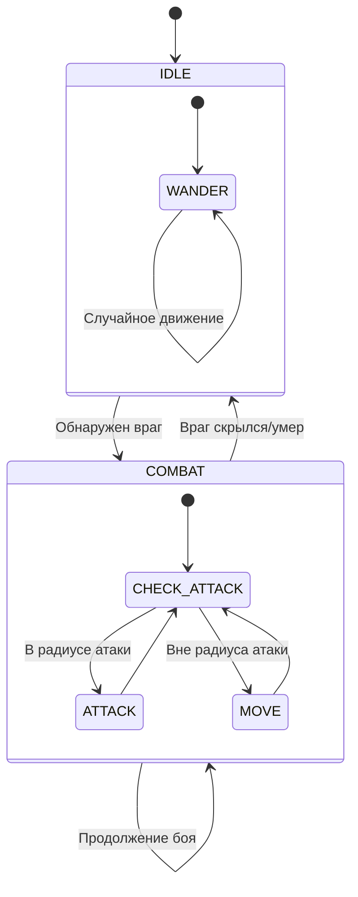

# Упрощенная система ИИ врагов

## Обзор

Упрощенная система ИИ врагов оставляет только два состояния: ожидание (IDLE) и битва (COMBAT). Все враги временно сделаны ближнего боя для упрощения тестирования.

## Основные изменения

### 1. Упрощение EnemyAI.js

- **Состояния ИИ**: Оставлены только `AI_STATE.IDLE` и `AI_STATE.COMBAT`
- **Типы поведения**: Оставлен только `BEHAVIOR_TYPE.WANDER`
- **Удаленные компоненты**:
  - Состояния `ALERT` и `FLEE`
  - Типы поведения `GUARD` и `PATROL`
  - Логика памяти о позиции врага
  - Сложная логика оптимальной дистанции

### 2. Временные изменения EnemyData.js

Все враги с дальним боем временно изменены на ближний бой:

- **MOLD (Плесневик)**: `range: 3` → `range: 1`
- **HOWLER (Воющий)**: `range: 999` → `range: 1` (особый случай, не атакует)
- **MUSHROOM (Грибник)**: `range: 2` → `range: 1`

### 3. Упрощение EnemyTeam.js

- Все враги теперь используют поведение `WANDER`
- Упрощена логика создания ИИ

## Как включить дальний бой позже

### Шаг 1: Восстановить дальний бой в EnemyData.js

Вернуть оригинальные значения `range` для врагов с дальним боем:

```javascript
// В файле src/game/EnemyData.js

[ENEMY_TYPES.MOLD]: {
  // ... другие параметры
  range: 3, // Восстановить оригинальное значение
  features: ['ranged', 'infection'],
  ignoreLos: true,
  // ...
},

[ENEMY_TYPES.HOWLER]: {
  // ... другие параметры
  range: 999, // Восстановить оригинальное значение
  // ...
},

[ENEMY_TYPES.MUSHROOM]: {
  // ... другие параметры
  range: 2, // Восстановить оригинальное значение
  // ...
}
```

### Шаг 2: Восстановить логику дальнего боя в EnemyAI.js

Добавить обратно проверки для дальнего боя:

1. **В методе `tryAttack`**:

```javascript
// Проверяем линию видимости для дальних атак
if (attackRange > 1 && !this.hasLineOfSight(target, map)) {
  console.log(`[COMBAT DEBUG] ${enemyName} не может атаковать: нет линии видимости`)
  return false
}
```

2. **В методе `executeCombatBehavior`**:

```javascript
// Определяем желаемую дистанцию остановки
// Для ближнего боя (attackRange = 1) используем дистанцию 1.5
// Для дальнего боя останавливаемся на расстоянии attackRange
let stopDistance = attackRange > 1 ? attackRange : 1.5

// Если уже находимся на желаемой дистанции, но нет линии видимости (для дальних атак),
// двигаемся ближе чтобы получить обзор
if (attackRange > 1 && distance <= attackRange && !this.hasLineOfSight(this.target, map)) {
  stopDistance = 1.5 // Двигаемся ближе
}
```

### Шаг 3: Восстановить разные типы поведения в EnemyTeam.js

Вернуть логику определения поведения на основе типа врага:

```javascript
getBehaviorForCharacter(character, enemyData) {
  // Враги с дальней атакой обычно охраняют позицию
  if (enemyData.range > 1) {
    return BEHAVIOR_TYPE.GUARD
  }

  // Быстрые враги патрулируют
  if (enemyData.initiative >= 6) {
    return BEHAVIOR_TYPE.PATROL
  }

  // Медленные враги блуждают
  if (enemyData.initiative <= 2) {
    return BEHAVIOR_TYPE.WANDER
  }

  // По умолчанию блуждание
  return BEHAVIOR_TYPE.WANDER
}
```

### Шаг 4: Восстановить состояние ALERT (опционально)

Если нужна более плавная реакция врагов, можно восстановить состояние `ALERT`:

1. Добавить обратно `AI_STATE.ALERT` в константы
2. Восстановить метод `executeAlertBehavior`
3. Настроить переход из `ALERT` в `COMBAT`

## Диаграмма состояний упрощенного ИИ



## Тестирование дальнего боя

После восстановления дальнего боя протестируйте:

1. **Враги с дальним боем остаются на месте** (поведение GUARD)
2. **Проверка линии видимости** - враги не должны атаковать через стены
3. **Оптимальная дистанция** - враги должны останавливаться на расстоянии атаки
4. **Движение для получения обзора** - если нет линии видимости, враги должны двигаться ближе

## Примечания

- Упрощенная система предназначена для тестирования базовой механики боя
- Для полноценной игры рекомендуется восстановить все состояния и типы поведения
- Состояние `FLEE` (бегство) можно добавить позже для врагов с низким здоровьем
